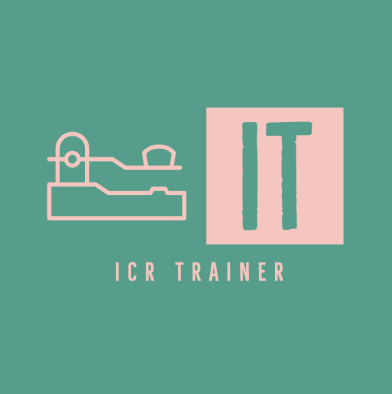

<!-- Improved compatibility of back to top link: See: https://github.com/othneildrew/Best-README-Template/pull/73 -->

<!--
*** Thanks for checking out the Best-README-Template. If you have a suggestion
*** that would make this better, please fork the repo and create a pull request
*** or simply open an issue with the tag "enhancement".
*** Don't forget to give ICR Trainer a star!
*** Thanks again! Now go create something AMAZING! :D
-->

<!-- PROJECT SHIELDS -->
<!--
*** I'm using markdown "reference style" links for readability.
*** Reference links are enclosed in brackets [ ] instead of parentheses ( ).
*** See the bottom of this document for the declaration of the reference variables
*** for contributors-url, forks-url, etc. This is an optional, concise syntax you may use.
*** https://www.markdownguide.org/basic-syntax/#reference-style-links
-->
[![Contributors][contributors-shield]][contributors-url]
[![Forks][forks-shield]][forks-url]
[![Stargazers][stars-shield]][stars-url]
[![Issues][issues-shield]][issues-url]
[![MIT License][license-shield]][license-url]

<!-- PROJECT LOGO -->
 

  

<h3 align="center">IT - The ICR Trainer</h3>

  

    Increase your code speed, improve your recognition. This ICR (Instant Character Recognition) Trainer will help you increase your morse code profiency.
     
    <a href="https://github.com/rohn/icrtrainer"><strong>Explore the docs »</strong></a>
     
     
    <a href="https://icrtrainer.com">View Demo</a>
    ·
    <a href="https://github.com/rohn/icrtrainer/issues">Report Bug</a>
    ·
    <a href="https://github.com/rohn/icrtrainer/issues">Request Feature</a>
  

<!-- TABLE OF CONTENTS -->

  
Table of Contents

  <ol>
    <li>
      <a href="#about-the-project">About ICR Trainer</a>
    </li>
    <li>
      <a href="#getting-started">Getting Started</a>
    </li>
    <li><a href="#usage">Usage</a></li>
    <li><a href="#contributing">Contributing</a></li>
    <li><a href="#license">License</a></li>
    <li><a href="#contact">Contact</a></li>
    <li><a href="#acknowledgments">Acknowledgments</a></li>
  </ol>

<!-- ABOUT ICR Trainer -->
## About ICR Trainer

[![ICR Trainer Screen Shot][product-screenshot]](https://github.com/rohn/icrtrainer/images/logo.png)

  This ICR Trainer was created after my <a href="https://cwops.org/cw-academy/">CW Academy</a> Advisor, <a href="https://www.qrz.com/db/W8OV">W8OV</a>, told us about one similar, written by one of his past students, that is no longer
  available on the web. Not only did the trainer sound like it would suit my style of practice, I thought I could further automate it to even better fit my wants and needs.

  The trainer will quiz you on morse characters, allowing you to hit a key on the keyboard that corresponds to a random morse character played. It keeps record of how long it takes you to hit that keyboard key after the character sound
  has finished. Since it's keeping record, it can also futz with the randomness and weight the random choice, paying more favor to the characters you are slower on. All with automation. You just need to listen and respond <i>quickly</i>.

  This application was written initially to fill my needs. As such it likely contains bugs if you deviate from the "happy path" much. You can quickly get out of any unknown state by simply reloading the page; your progress will be saved.

  Speaking of progress... yes, your progress is saved locally in your browser's cache. Nothing is sent over the internet to another computer. Nothing is tracked external to your computer. The progress bars you see at the bottom of the
  trainer display <i>relative</i> progress. You should only compare each progress bar with other progress bars, and not try to make a correlation to actual elapsed time.

  This effort is open sourced and can be found at <a href="http://github.com/rohn/icrtrainer">http://github.com/rohn/icrtrainer</a>. Any bugs you would like to report can be entered under the <strong>Issues</strong> tab on that page.

  Regarding bugs, restarting from a paused state is known to be somewhat iffy. If you pause, simply reload the page to continue. It's an inconvenience but your progress will have been saved when you hit pause. I'll of course address serious
  issues that impede advancing skills, but like you, I am focused on increasing my code speed and so minor issues might not be addressed immediately.

(<a href="#readme-top">back to top</a>)

<!-- GETTING STARTED -->
## Getting Started

Probably the simplest means, and the one most people will follow, is to head to [http://ICRTrainer.com](http://icrtrainer.com) and use the existing version there.

Once on the website, whether at [http://ICRTrainer.com](http://icrtrainer.com) or a locally hosted version, the simplest path to get started would be to:

<ol style="margin-left: 60px; margin-bottom: 20px">
  <li>click the <code>enable background audio</code> button</li>
  <li>adjust the sidetone frequency to your liking</li>
  <li>adjust the volume and speed controls, if necessary</li>
  <li> click the <code>play</code>button</li>
  <li>start hitting keys that correspond to the morse character played</li>
</ol>

(<a href="#readme-top">back to top</a>)

<!-- USAGE EXAMPLES -->
## Usage

As you respond to the morse code characters sent, the tally at the bottom of the screen will constantly update. The taller the bar, the longer it has taken you to recognize that character, <i>averaged over the last 10 times that character was sent</i>.
Characters played are a weighted random order, giving precedence to those characters that you are slower on.

(<a href="#readme-top">back to top</a>)

<!-- CONTRIBUTING -->
## Contributing

Contributions are what make the open source community such an amazing place to learn, inspire, and create. Any contributions you make are **greatly appreciated**.

If you have a suggestion that would make this better, please fork the repo and create a pull request. You can also simply open an issue with the tag "enhancement".
Don't forget to give ICR Trainer a star! Thanks again!

1. Fork ICR Trainer
2. Create your Feature Branch (`git checkout -b feature/AmazingFeature`)
3. Commit your Changes (`git commit -m 'Add some AmazingFeature'`)
4. Push to the Branch (`git push origin feature/AmazingFeature`)
5. Open a Pull Request

(<a href="#readme-top">back to top</a>)

<!-- LICENSE -->
## License

Distributed under the MIT License. See `LICENSE.txt` for more information.

(<a href="#readme-top">back to top</a>)

<!-- CONTACT -->
## Contact

Your Name - [@rohn](https://twitter.com/rohn) - rohn@intensiveporpoises.com

Project Link: [https://github.com/rohn/icrtrainer](https://github.com/rohn/icrtrainer)

(<a href="#readme-top">back to top</a>)

<!-- ACKNOWLEDGMENTS -->
## Acknowledgments

* [Matthew A Adams - for his morse practice github repo](https://github.com/matthew-a-adams/)
* [https://github.com/matthew-a-adams/morse-practice-scripts](https://github.com/matthew-a-adams/morse-practice-scripts)

(<a href="#readme-top">back to top</a>)

<!-- MARKDOWN LINKS & IMAGES -->
<!-- https://www.markdownguide.org/basic-syntax/#reference-style-links -->
[contributors-shield]: https://img.shields.io/github/contributors/rohn/icrtrainer.svg?style=for-the-badge
[contributors-url]: https://github.com/rohn/icrtrainer/graphs/contributors
[forks-shield]: https://img.shields.io/github/forks/rohn/icrtrainer.svg?style=for-the-badge
[forks-url]: https://github.com/rohn/icrtrainer/network/members
[stars-shield]: https://img.shields.io/github/stars/rohn/icrtrainer.svg?style=for-the-badge
[stars-url]: https://github.com/rohn/icrtrainer/stargazers
[issues-shield]: https://img.shields.io/github/issues/rohn/icrtrainer.svg?style=for-the-badge
[issues-url]: https://github.com/rohn/icrtrainer/issues
[license-shield]: https://img.shields.io/github/license/rohn/icrtrainer.svg?style=for-the-badge
[license-url]: https://github.com/rohn/icrtrainer/blob/master/LICENSE.txt
[linkedin-shield]: https://img.shields.io/badge/-LinkedIn-black.svg?style=for-the-badge&logo=linkedin&colorB=555
[linkedin-url]: https://linkedin.com/in/rohnblake
[product-screenshot]: images/screenshot.jpg
[Next.js]: https://img.shields.io/badge/next.js-000000?style=for-the-badge&logo=nextdotjs&logoColor=white
[Next-url]: https://nextjs.org/
[React.js]: https://img.shields.io/badge/React-20232A?style=for-the-badge&logo=react&logoColor=61DAFB
[React-url]: https://reactjs.org/
[Vue.js]: https://img.shields.io/badge/Vue.js-35495E?style=for-the-badge&logo=vuedotjs&logoColor=4FC08D
[Vue-url]: https://vuejs.org/
[Angular.io]: https://img.shields.io/badge/Angular-DD0031?style=for-the-badge&logo=angular&logoColor=white
[Angular-url]: https://angular.io/
[Svelte.dev]: https://img.shields.io/badge/Svelte-4A4A55?style=for-the-badge&logo=svelte&logoColor=FF3E00
[Svelte-url]: https://svelte.dev/
[Laravel.com]: https://img.shields.io/badge/Laravel-FF2D20?style=for-the-badge&logo=laravel&logoColor=white
[Laravel-url]: https://laravel.com
[Bootstrap.com]: https://img.shields.io/badge/Bootstrap-563D7C?style=for-the-badge&logo=bootstrap&logoColor=white
[Bootstrap-url]: https://getbootstrap.com
[JQuery.com]: https://img.shields.io/badge/jQuery-0769AD?style=for-the-badge&logo=jquery&logoColor=white
[JQuery-url]: https://jquery.com 
[Plotly.js]: https://plotly.com/
